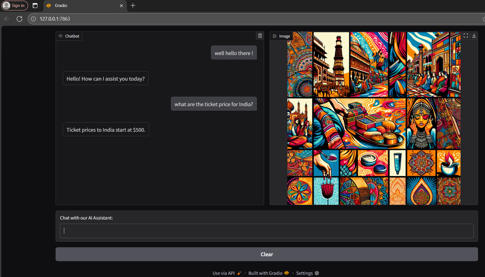

# ✈️ FlightAI – Airline Customer Assistant (Capstone Project)

FlightAI is a hands-on capstone project.  
It showcases the use of OpenAI's tool calling system with a conversational assistant designed to simulate an airline helpdesk.

---

## 🚀 Features

- 🤖 **LLM-Powered Chatbot** (OpenAI GPT-4o-mini)
- 🔧 **Tool Use**: Answers ticket price queries via a function-based lookup
- 🎨 **Image Generation**: Produces city-themed travel posters using DALL·E
- 🧠 **Context-Aware Reasoning**: Understands and remembers multi-turn dialogue
- 💬 **Interactive UI**: Built with Gradio Blocks layout

---

## 💻 Tech Stack

- **Python**
- **OpenAI API**
- **Gradio**
- **Dotenv (for secret management)**
- **Pillow (image decoding)**

---

## 📸 Output Demo

Below is a sample interaction where the assistant answers a ticket price query and shows a DALL·E-generated city image:



---

## 🔐 API Key Management

The project uses a `.env` file (not included in this repo) to manage your API key safely.

Create a file named `.env` with this content:

```env
OPENAI_API_KEY=your_openai_key_here
